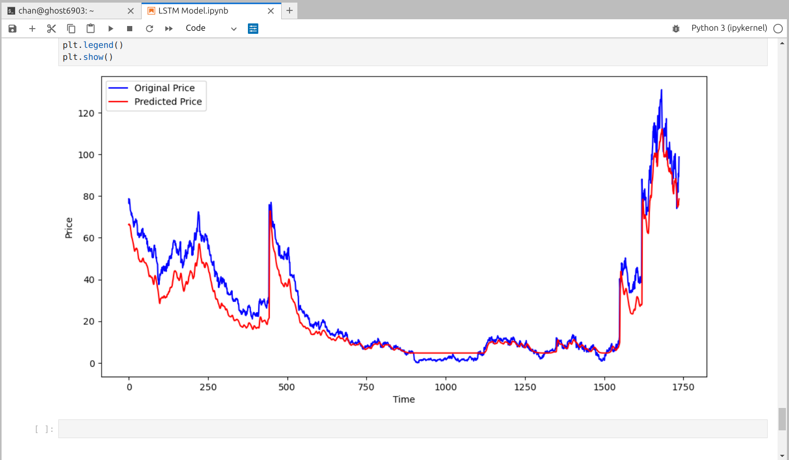

# stockPredictionML
An LSTM model to predict the stock price.

Model Prediction:

# Stock Price Prediction with LSTM ML model

This Python project uses Long Short-Term Memory (LSTM) neural networks to predict stock prices. It leverages the Keras library for building the deep learning model, pandas and numpy for data manipulation, matplotlib for chart plotting, and Streamlit for deployment.

## Project Overview

In this project, we aim to predict stock prices using historical data. We utilize the following key components:

- **Keras:** We employ Keras, a high-level deep learning framework, to build our LSTM model. Keras is integrated with TensorFlow, which serves as the backend for our neural network.

- **Pandas and Numpy:** We use pandas for data management and manipulation, allowing us to organize and preprocess the historical stock price data. Numpy is used to work with numerical arrays, facilitating data transformations.

- **Matplotlib:** We visualize the stock price predictions and historical data trends using Matplotlib's chart plotting capabilities.

- **Streamlit:** To make the project accessible, we deploy the model using Streamlit, creating an interactive web application that enables users to input stock symbols and view price predictions.
